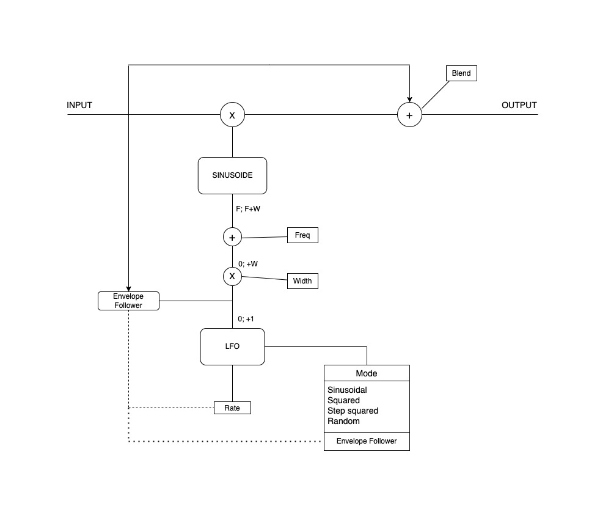

# RingWorm Modulator

    

 

 
    RingWorm Modulator is a basic emulation of the iconic Ring Worm Modulator pedal from Way Huge. It is designed for mono audio signal and it provides a wide range of creativities possibilities thanks to the amplitude modulation made by the oscillator, and the different LFO waveforms. 

 

## Key features

<ul>
  <li>Ring modulation: the heart of the plugin is ring modulation, a technique that produces unique, harmonically rich sounds by multiplying the input signal with a sine oscillator used as the carrier wave. 
        <ul>
          <li>FREQ: this parameter adjusts the frequency of the carrier wave</li>
      </ul>
  </li>
  <li>LFO waveforms: the carrier wave is modulated in frequency by an LFO (Low Frequency Oscillator) that offers a diverse range of waveforms.    The LFO is controlled by three parameters:
      <ul>
          <li>MODE: select the waveform shape
              <ul>
                  <li>Sine</li>
                  <li>Step squared</li>
                  <li>Squared</li>
                  <li>Random: this mode generates a waveform composed by random values</li>
                  <li>Envelope follower: this mode uses the envelope of the input signal as the LFO waveform, creating dynamic and responsive modulation effects that follow the dynamics of the original signal</li>
              </ul>
          </li>
          <li>rate: adjusts the frequency of the LFO</li>
          <li>width: controls the amplitude of the LFO, determining the depth of the modulation</li>
    </ul> 
  </li>
  <li>BLEND: this parameter controls the intensity of the modulation on the output signal. When set to zero, the modulation effect is completely bypassed</li>
</ul> 

## 
 

The following scheme shows the structure of the plugin, illustrating the signal flow and processing stages

    

