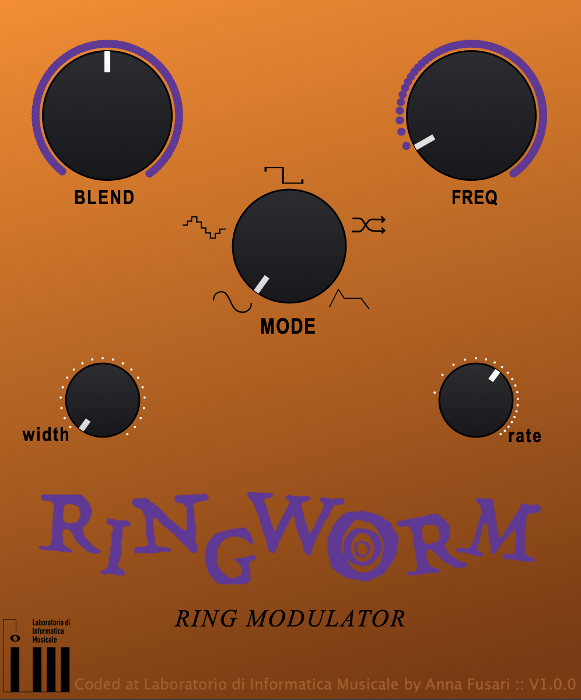

# Ring Worm Modulator

    

 

 
    RingWorm Modulator is a basic emulation of the iconic Ring Worm Modulator pedal from Way Huge. It is designed for mono audio signal and it provides a wide range of creativities possibilities thanks to the amplitude modulation made by the oscillator, and the frequency modulation made by the LFO on the carrier sinusoid.

 
